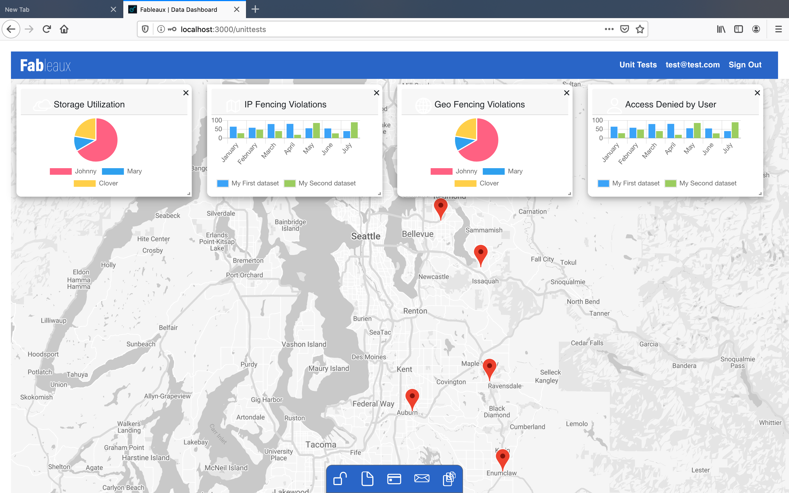

# SilverMoon Data Visualization

SilverMoon is a 100% bootstrap-free implementation of React-Grid in conjunction with the Google API as an underlying base-layer.

Geo mapping shows data in space and time, which is the base layer of the User Experience (UX). Customizing the Google Map API User Interface (UI) is our solution to achieve this intuitive  display functionality.

But that's not the only way to view things of course! Floating widgets over the map, a different dataview in conjunction with a geo mapped presentation, seems like the cat's whiskers.
